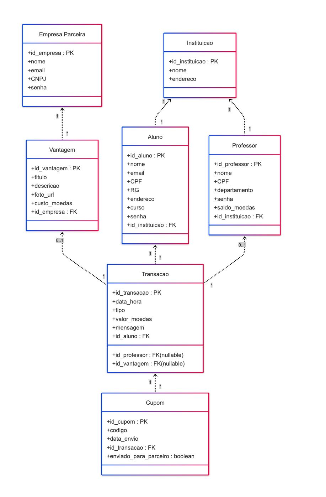
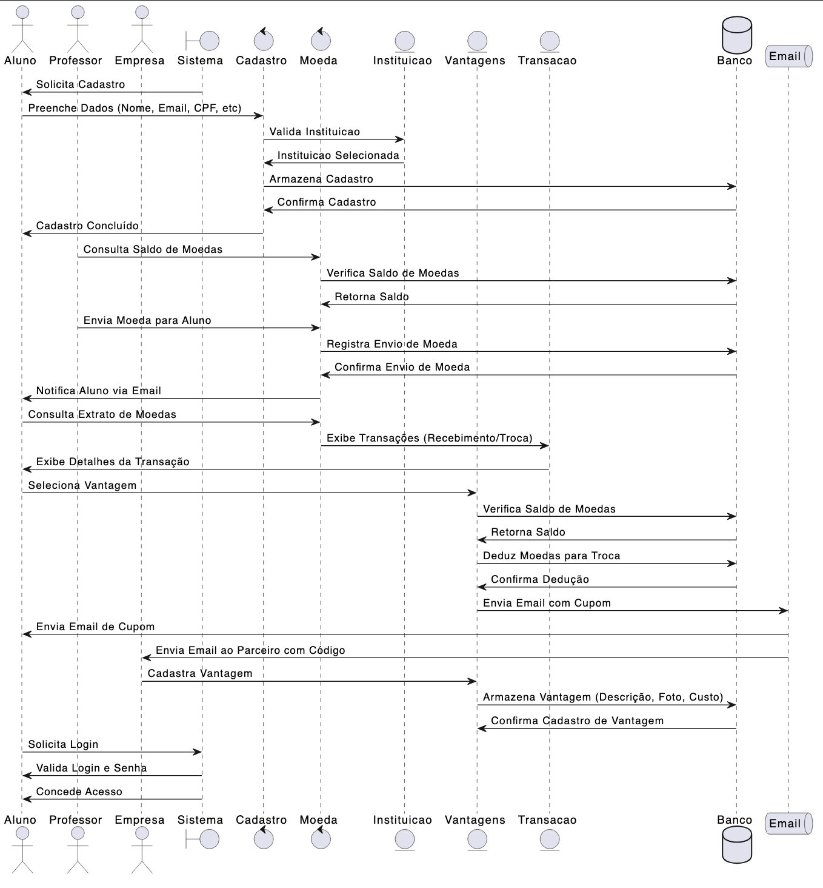
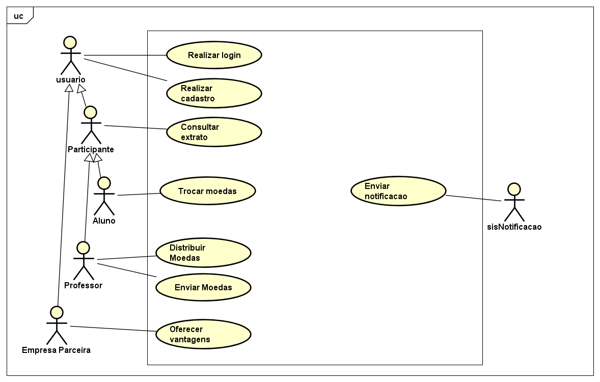

# SME
## Introdução
Este projeto propõe o desenvolvimento de um sistema que estimula o reconhecimento do mérito estudantil por meio de uma moeda virtual. Professores podem distribuir moedas aos alunos como forma de incentivo, e os alunos podem trocá-las por produtos e descontos oferecidos por empresas parceiras. O sistema contempla funcionalidades como cadastro de usuários, controle de saldo, envio de moedas com mensagens, consulta de extratos, resgate de vantagens e autenticação segura para todos os perfis.

## Diagrama de Entidade e Relacionamento

 

## Diagrama de Sequencia

 

## Diagrama de Casos de Uso

 

